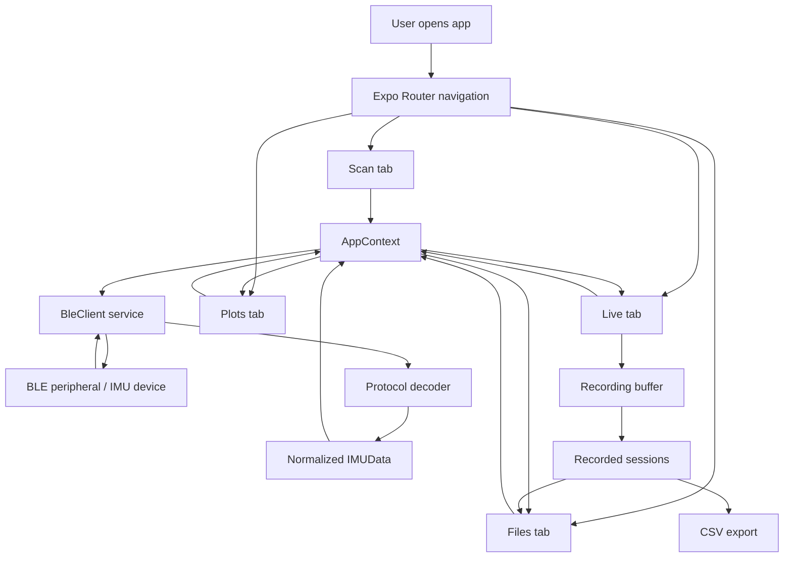

# AI-Assisted Development Plan
This document summarizes the step-by-step development plan created with AI support and includes a simple flowchart of the main components and data flow.

## 1. Step-by-step AI-assisted plan
1. Define the target app structure based on the prototype and confirm the main mobile screens: **Scan**, **Live**, **Plots**, and **Files**.
2. Set up the navigation shell using Expo Router so each major function has its own tab.
3. Create a centralized app state layer to avoid duplicating BLE, telemetry, recording, and session logic across screens.
4. Implement the BLE service layer to manage permissions, scanning, connection, notifications, fallback reads, and stream control.
5. Define a normalized telemetry model so all incoming BLE payload formats can be decoded into one common sensor-data structure.
6. Build the **Scan** screen with status display, scan controls, discovered device cards, RSSI information, and connect actions.
7. Build the **Live** screen with grouped sensor cards for acceleration, gyroscope, and Euler angles, plus recording controls.
8. Build the **Plots** screen with time-range selection, pause/resume, smoothing, scaling controls, and orientation preview.
9. Implement native-friendly plotting with SVG instead of browser-only charting libraries.
10. Build the **Files** screen to show recorded sessions, storage summary, CSV export, and delete actions.
11. Implement CSV export so recorded telemetry can be saved and shared outside the app.
12. Connect all screens to the shared context and BLE service so UI updates reflect real device state.
13. Add error handling and recovery paths for permissions, Bluetooth state, and connection issues.
14. Review the design against the original prototype and adjust the mobile layout where necessary for real smartphone usability.
15. Produce final documentation summarizing design implementation, AI Q&A guidance, AI usage, and development planning.

## 2. Key implementation areas influenced by AI
- Navigation design and screen separation
- Centralized state management with shared context
- BLE service abstraction and configuration strategy
- Normalized telemetry decoding model
- Native plotting approach using SVG
- CSV export workflow
- Documentation structure and report preparation

## 3. Flowchart: key components and data flow

## 4. Short summary
AI support was used to help organize the work into a clear sequence: define the app structure, separate concerns into UI/state/service layers, normalize BLE data handling, implement the four main screens, add export capability, and then document the final system. The resulting plan helped reduce development time and kept both the code structure and documentation consistent.